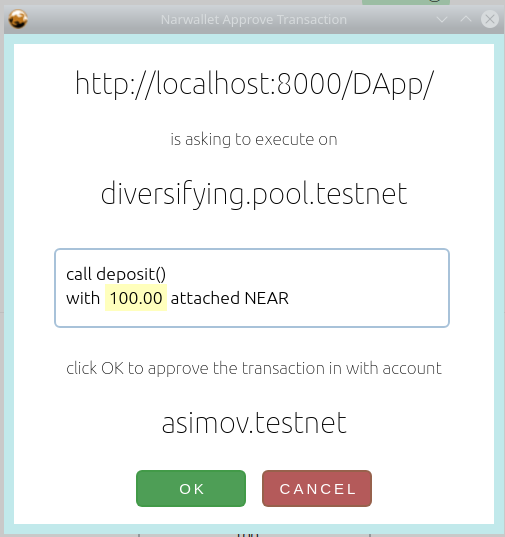

# Wallet API - Web App connection design

## Vision

Assumptions:
1) We want to support static-server single-page web-apps: SPA Web Apps, that can be served from IPFS or siasky. Also we want to preserve the SPA state (avoid  navigating out of the site), that's why this is a chrome/chromium extension wallet.

2) Our "model-user" is not an expert. Our user doesn't want to have to acquire deep knowledge of the underlying technologies to use the application. 
For example, even if EIP712 is a huge improvement, in the eyes of our hypothetical user, the before and after of EIP721 are unreadable

 *([EIP712 "before and after"](https://ethereum-magicians.org/t/eip-712-eth-signtypeddata-as-a-standard-for-machine-verifiable-and-human-readable-typed-data-signing/397). To read/understand/verify the data in the image on the right, you need way more knowledge our model-users have, so both screens are unreadable to them. Amounts with that many zeroes are confusing and hard to read and they don't know what to do with a unix timestamp. Our users are not necessarilly experts)*

3) This is what we want our users to see when approving transactions: 

 *example from DApp-diversifying-staking-pool & narwallet*
  The info here for the user is: what application is currently connected, what contract the user is going to operate on and what function exactly is going to call, with all the amounts in NEAR (no yoctos, all easy to read amounts), and finally what account is connected and will sign the transaction.

4) We want to ease-up the onboarding of ethereum users. One of the NEAR features more alien to eth users is the fact that an account can have *more than one private key*. We're hiding that functionality. In normal operations, we're asking for the seed phrase or a priv-key (full access) and then sign transactions with that, i.e. the wallet is not adding keys to the user's near account.
