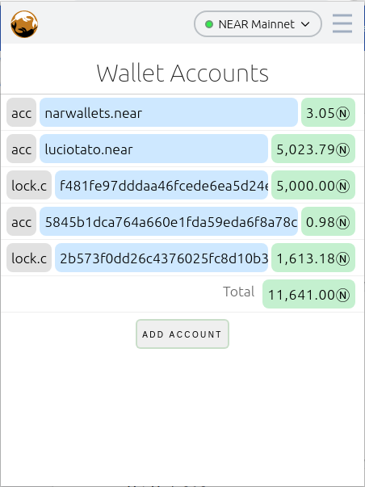

# Narwallet Chrome Extension 

## Beta Test Installation (v0.1)

* clone this repository on your machine and:
  * open chrome
  * enable Extensions Developer Mode
  * load unpacked extension from [dir-where-you-cloned]/Narwallets-extension/extension

## Objectives
* Be the deafult chrome-extension wallet for NEAR DApps
* What Metamask does for ethereum, we intend to do for NEAR

## Comparision with NEAR Official Web Wallet
* Narwallets-extension aims to be a simpler and complemetary tool to the official NEAR Web wallet
* Narwallets is designed for a desktop/laptop expreience with a chromium based browser, NEAR Web wallet works on any browser and mobile
* Narwallets is available only in english, NEAR Web wallet supports multiple languages
* Narwallets is not yet integrated with Ledger or other HW Wallets
* Narwallets has only one option regading account recovery: Write-down the seed phrase. NEAR Web Wallet has other user-friendly recovery options (email & phone recovery).
* Narwallets, aiming at simplicity, has no 2FA support.
* The good:
* It's an extension-wallet: With v0.2 you'll be able to interact with DApps without leaving the DApp site
* Provide a similar experience as Metamask/other eth extension-wallets to ease the onboard ethereum users into the NEAR ecosystem.
* You can have multiple wallets by providing different user/passwords. 
* Each wallet can have multiple accounts. You can see the sum of all accounts in the wallet
* Accounts are first added to a wallet in safe-by-default read-only mode. 
* All private data is stored encrypted on chrome local storage
* Lockup contract accounts are auto-discovered and treated as another account in the group
* Advanced mode allows you to take control and liquidate lockup contract accounts

## Road Map to v0.2
* Integration with DApp - modeled after docs.ethers.io/v5 ? other? new approach?
* Manage Create account (currently redirecting to NEAR Web Wallet)
* Trello Board at https://trello.com/b/SRbigp2g

## Future versions
* Ledger integration

## Dev Tooling (v0.1)
* This project uses ES2020 modules import/export
* Being a chrome extension, no bundler/minimizer is needed 
* No frameworks are used neither, this is plain ts/javascript

## Dev Flow (v0.1)
* Chrome Dev Tools: Map folder to Narwallets-extension/extension
* Use Chrome Dev Tools as an quick-and-dirty IDE with Edit & Continue
* Use VSCode as the main IDE - Ctrl-Shift-B to build with (plus)typescript
* This project uses [plus-typescript](https://github.com/luciotato/plus-typescript) so you can modify "sources" directly from Chrome Dev Tools (no source-maps, no transpiling).  This can change in future versions, we might move to standard ts

## Low-level Technical debt

* Main code is plus-typescript, but /api (light-near-api) is standard typescript. The mix creates confusion

* We're using base crypto libs as a bundle (The ideal solution would be to have typescript versions of each lib and compile to ES2020 modules) 

We need to reduce the bundle's size. Bundle is at https://github.com/Narwallets/bundled-crypto-libs.git

Bundle includes:

* globalThis.Buffer = SafeBuffer.Buffer
* globalThis.BN = BN
* globalThis.bip39 = bip39
* globalThis.pbkdf2 = pbkdf2
* globalThis.createHmacPackage = {createHmac:createHmac} 

## VSCode config tips

VSCode Configured by: https://code.visualstudio.com/docs/typescript/typescript-compiling#_using-newer-typescript-versions

    //.vscode/settings.json
    {
        "debug.allowBreakpointsEverywhere": true,
        "typescript.tsdk": "./node_modules/plus-typescript/lib"
    }
